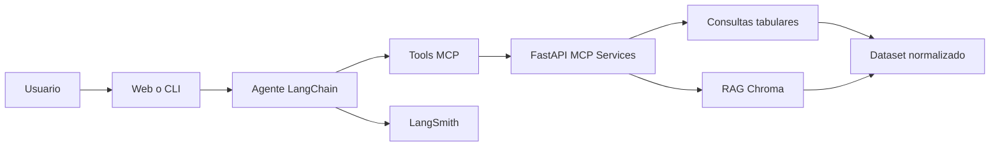

# ai-conversation-agent

Agente conversacional para analizar conversaciones digitales con servicios MCP,
LangChain, LangSmith y RAG sobre un dataset de comentarios e hilos.

## Estado del proyecto

El proyecto ya cubre:

- Carga, inspeccion y normalizacion del dataset.
- Consultas de comentarios, hilos y arbol de respuestas.
- Metricas de propagacion: alcance, profundidad, respuestas directas, ventana temporal, demora de primera respuesta y velocidad promedio.
- Servicios MCP con FastAPI para emociones, resumen, propagacion y busqueda semantica.
- Cliente HTTP y tools de LangChain para consumir los MCP.
- Agente conversacional con LangChain.
- RAG con Chroma y un backend de embeddings configurable.
- Validacion con LangSmith en una ejecucion real del proyecto.

## Arquitectura



## Estructura relevante

- `src/agent`: agente, CLI, tools y scripts de validacion.
- `src/mcp_services`: API FastAPI y contratos de entrada.
- `src/data`: carga del dataset y consultas tabulares.
- `src/rag`: construccion del indice, embeddings y busqueda semantica.
- `tests`: pruebas unitarias y de API.

## Modos de trabajo

### Modo desarrollo

Pensado para avanzar sin depender de OpenAI.

- `APP_MODE=development`
- `USE_LLM_ANALYSIS=false`
- `RAG_EMBEDDING_BACKEND=local`
- `RAG_AUTO_BUILD=false`

En este modo:

- emociones y resumen usan heuristicas o resumen extractivo;
- el indice RAG se construye de forma explicita;
- el agente con LLM puede quedar deshabilitado si no hay cuota.

### Modo demo

Pensado para una demostracion con OpenAI y trazas.

- `APP_MODE=demo`
- `OPENAI_API_KEY` valida
- `OPENAI_MODEL` configurado
- `LANGSMITH_TRACING=true`
- `LANGSMITH_API_KEY` configurada

## Configuracion

Crea un archivo `.env` basado en `.env.example`.

Variables principales:

- `APP_MODE`: `development` o `demo`.
- `USE_LLM_ANALYSIS`: activa resumen y emociones con LLM dentro de los endpoints.
- `RAG_EMBEDDING_BACKEND`: `local` para desarrollo o `openai` para demo.
- `RAG_AUTO_BUILD`: si es `true`, construye el indice al primer uso. Por defecto queda apagado para hacer el proceso reproducible.
- `LANGSMITH_VALIDATION_ROOT_ID`: `root_id` usado por el script de validacion de trazas.

Nota: `data/chroma_db/` ya esta excluido del control de versiones en `.gitignore`.

## Puesta en marcha

### 1. Activar entorno

```powershell
.\.venv\Scripts\Activate.ps1
```

### 2. Construir el indice RAG

Modo desarrollo con embeddings locales:

```powershell
$env:APP_MODE="development"
$env:RAG_EMBEDDING_BACKEND="local"
python -m src.rag.build_index --force-rebuild
```

### 3. Levantar los servicios MCP

```powershell
$env:APP_MODE="development"
$env:RAG_EMBEDDING_BACKEND="local"
python -m uvicorn src.mcp_services.app:app --reload
```

URLs principales:

- Swagger: `http://127.0.0.1:8000/docs`
- Frontend: `http://127.0.0.1:8000/`

### 4. Validar el flujo sin LLM

```powershell
python -m src.agent.check_mcp_client
python -m src.agent.check_tools
python -m src.agent.rule_based_cli
```

### 5. Validar LangSmith

Con el servidor activo y las variables de LangSmith configuradas:

```powershell
python -m src.agent.check_langsmith
```

Salida esperada:

- nombre del proyecto;
- `run_id` generado;
- `Trace visible: True`.

Para ver la traza:

1. entra a tu proyecto en LangSmith;
2. abre el proyecto configurado en `LANGSMITH_PROJECT`;
3. busca el run `validacion_langsmith_propagacion` o el `run_id` impreso por el script.

### 6. Ejecutar el agente con LLM

```powershell
python -m src.agent.chat_cli
```

Si OpenAI devuelve `429 insufficient_quota`, el problema es de cuota o billing, no del codigo. En ese caso usa `rule_based_cli` para desarrollo y `check_langsmith` para validar observabilidad.

## Endpoints MCP

### `POST /analisis/emociones`

Busca comentarios por texto y devuelve distribucion emocional y comentarios enriquecidos.

### `POST /analisis/resumen`

Resume un hilo por `thread_id` y devuelve mensajes representativos y distribucion de sentimiento.

### `POST /analisis/propagacion`

Calcula arbol de respuestas y metricas de propagacion para un `root_id`.

### `POST /analisis/busqueda_semantica`

Consulta el indice RAG. Si el indice no existe, responde con error controlado y pide construirlo primero.

## Como funciona RAG

El flujo RAG queda separado en el paquete `src/rag`:

1. se carga el dataset normalizado;
2. se filtran comentarios utiles;
3. se generan documentos con metadatos simples;
4. se construye o carga un indice persistente en Chroma;
5. las consultas de busqueda semantica recuperan comentarios similares.

En desarrollo se usan embeddings locales deterministas para evitar consumo de OpenAI. En demo puede usarse `RAG_EMBEDDING_BACKEND=openai` y reconstruir el indice con ese backend.

## Scripts utiles

- `python -m src.rag.build_index --force-rebuild`: reconstruye el indice RAG.
- `python -m src.agent.check_mcp_client`: valida cliente HTTP contra FastAPI.
- `python -m src.agent.check_tools`: valida registro e invocacion de tools.
- `python -m src.agent.check_agent "..."`: ejecuta una sola consulta al agente con LLM.
- `python -m src.agent.check_langsmith`: valida trazas de LangSmith con una ejecucion real del proyecto.

## Pruebas

Pruebas recomendadas:

```powershell
python -m pytest tests/test_api.py tests/test_agent.py tests/test_queries.py tests/test_rag.py
```

Las pruebas de RAG y propagacion no dependen de OpenAI real.

## Despliegue en Render

El proyecto incluye [Dockerfile](Dockerfile) y [render.yaml](render.yaml) como base para desplegar el backend.

Pasos generales:

1. subir el repositorio a GitHub;
2. crear un `New Web Service` en Render conectado al repo;
3. dejar que Render construya usando el `Dockerfile`;
4. configurar variables de entorno como `OPENAI_API_KEY`, `OPENAI_MODEL`, `APP_MODE`, `USE_LLM_ANALYSIS` y `LANGSMITH_*` si quieres trazas;
5. validar la API desplegada con `/health` y `/docs`.

Si quieres que el cliente o el agente apunten al backend desplegado, usa la URL publica del servicio.

## Preguntas de demo

Preguntas sugeridas para mostrar las capacidades implementadas:

- `Analiza las emociones en comentarios sobre reforma laboral.`
- `Resume el hilo thread_id tikapi_7520430294948793606.`
- `Analiza la propagacion del root_id 106064209472141_767905085584441.`
- `Que comentarios hablan de reforma laboral y precarizacion?`
- `Busca comentarios sobre miedo, incertidumbre o crisis economica.`
- `Que tan rapido se propago la conversacion del root_id 106064209472141_767905085584441?`
- `Cuales son los mensajes mas representativos del hilo tikapi_7520430294948793606?`

## Troubleshooting

### `RAG index not found`

Construye el indice antes de consultar:

```powershell
python -m src.rag.build_index --force-rebuild
```

### `The RAG index was built with a different embedding backend`

El indice fue creado con `local` u `openai` y luego cambiaste la configuracion. Reconstruyelo con el backend correcto.

### `429 insufficient_quota`

La clave de OpenAI existe pero no tiene cuota disponible. El sistema puede seguir validandose en modo desarrollo.

### `Trace visible: False`

Verifica `LANGSMITH_TRACING`, `LANGSMITH_API_KEY` y `LANGSMITH_PROJECT`. Si el script acaba de correr, vuelve a ejecutarlo porque la visibilidad del run puede tardar unos segundos.
